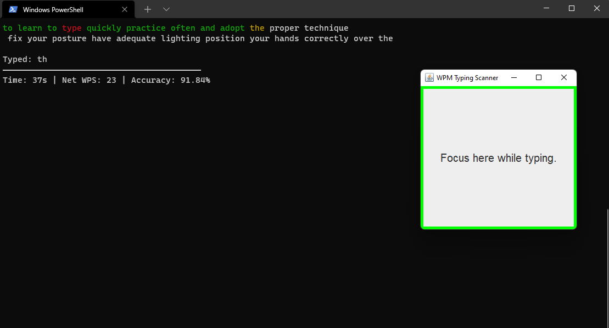

# Java Terminal Real Time WPM Calculator
<p align="center">
   
</p>

## What is Words Per Minute (WPM)?
Is a measure of words processed in a minute, often used as a measurement of the speed of typing, reading or Morse code sending and receiving.

> 🌐 For more details: https://en.wikipedia.org/wiki/Words_per_minute

## Used Tools
- Java Swing
- Multithreading

## Usage
### Run Project
- Locate ```WPMCalculator``` folder any terminal (e.g. Powershell, Comand Prompt).
- ⚠️ Must be ```words.txt``` and ```RealTimeWPMCalculator.jar``` same location.
- Run comand: ```java -jar .\RealTimeWPMCalculator.jar```

### Customizing Test Words
- Change words in ```words.txt``` and save.

## Fetures
- Real time gross WPM, net WPM and accuracy calculation.
- Test words customization.
- Word count customization per line.

## Screenshots
### Start Screen


### Test Screen


### Result Screen


## License
MIT
